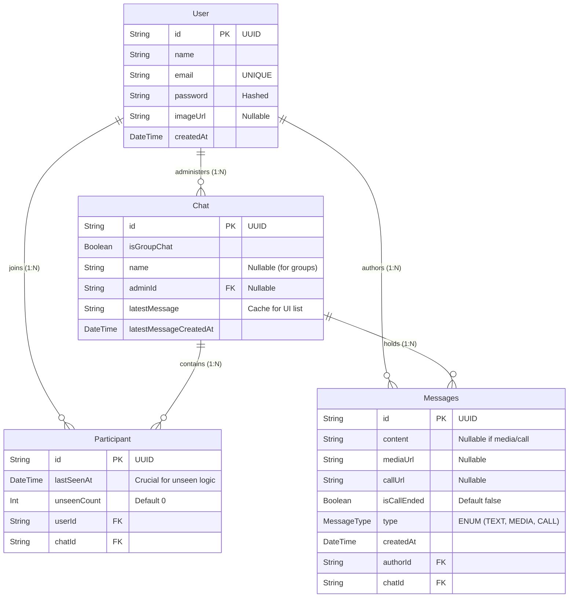

# Database Schema & Data Modeling

StreamLy utilizes **PostgreSQL** as its core relational database, managed via the **Prisma ORM**. This document provides an exhaustive breakdown of the entity relationships, indexing strategies, and the specialized logic used for massive group handling and read receipts.

---

## 🗺️ Entity-Relationship (ER) Diagram

The following Mermaid ER Diagram maps out the complete database schema defined in `schema.prisma`.

---

## 📖 Exhaustive Data Dictionary & Group Handling

StreamLy is designed specifically to handle **large groups**. The schema reflects necessary optimizations to prevent database locking when querying active chats.

### 1. The `User` Entity
The central identity of the system.
*   **Authentication**: The `password` field stores Bcrypt hashes, never plain text. 
*   **Indexing**: `email` is strictly `@unique`, enforcing O(1) lookup times during authentication flows.

### 2. The `Chat` Entity (1-to-1 and Groups)
Represents a conversation room. StreamLy unifies 1-to-1 DMs and massive Group Chats into this single entity.
*   **`isGroupChat`**: A boolean flag. If `true`, the `name` field is utilized and the `adminId` (foreign key to `User`) holds administrative rights (kicking users, renaming). If `false`, it represents a direct message.
*   **UI Caching Strategy**: The `latestMessage` and `latestMessageCreatedAt` fields act as a denormalized cache. 
    *   *Why?* When the frontend renders the sidebar list of 50 active chats, querying the `Messages` table to find the latest message for every single chat requires complex `GROUP BY` subqueries that cause massive I/O load. By caching this directly on the `Chat` object during the Kafka insertion phase, the sidebar query becomes a lightning-fast single table scan `ORDER BY latestMessageCreatedAt DESC`.

### 3. The `Participant` Entity (The Junction & Notification Engine)
This is an explicit many-to-many junction table between `User` and `Chat`. It does far more than just link records; it is the engine for StreamLy's highly efficient read receipts system.

*   **Composite Unique Constraint**: `@@unique([userId, chatId])` ensures a user can only be added to a group once, preventing UI duplication bugs.
*   **The Unseen Notification Architecture**: 
    *   In a group of 500 people, tracking exactly who has read which specific message requires millions of database rows (a `MessageReceipt` table). This is how apps fail at scale.
    *   **StreamLy's Approach**: We simply track a `lastSeenAt` timestamp and an `unseenCount` integer on the `Participant` record.
    *   When a new message arrives via Kafka, the background worker increments `unseenCount` by 1 for all `Participant` records in the chat *except* the author.
    *   When a user opens the chat UI, the frontend emits a `MARK_SEEN` event. The backend instantly sets `unseenCount = 0` and updates `lastSeenAt = now()`. This $O(1)$ update completely eliminates the need for complex unread tracking arrays, saving gigabytes of database storage.

### 4. The `Messages` Entity
The permanent ledger of all communications.
*   **Polymorphic Content**: The `MessageType` enum (`TEXT`, `MEDIA`, `CALL`) dictates which fields are populated.
    *   If `MEDIA`, `mediaUrl` contains the AWS S3 pointer.
    *   If `CALL`, `callUrl` contains the Mediasoup room link, and `isCallEnded` tracks the historical state of the video session.
*   **Cascade Deletions**: Configured with `onDelete: Cascade`. If an administrator deletes a `Chat`, PostgreSQL automatically purges millions of associated `Messages` and `Participant` rows cleanly at the C-level, without requiring Node.js application logic.
