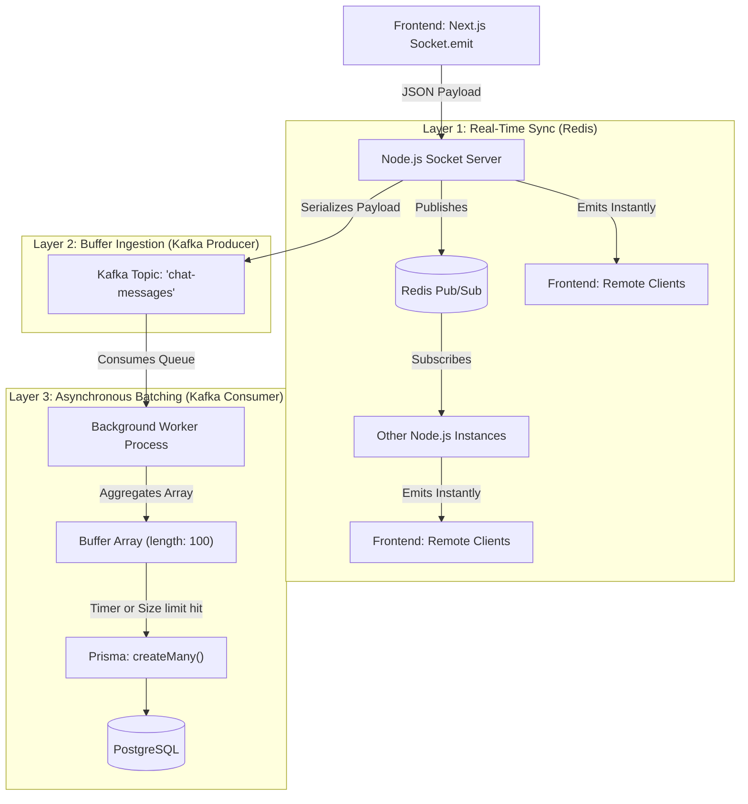
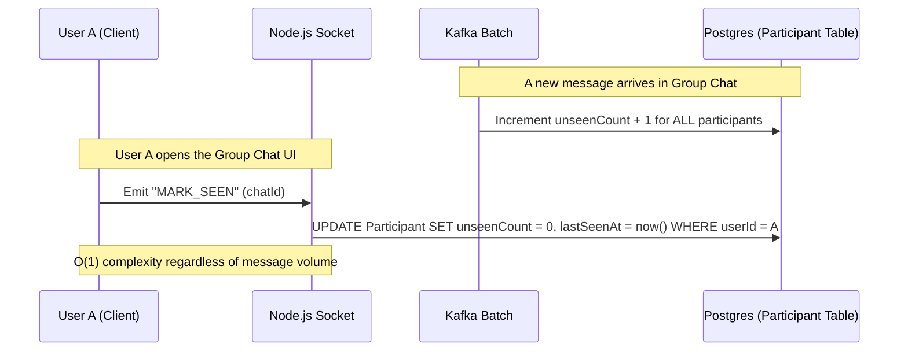

# Messaging, Redis, and Kafka Architecture

StreamLy is built to sustain massive, concurrent group chats. The central technical challenge of high-frequency group messaging is protecting the persistent database from instantaneous write amplification. 

This document exhaustively details the data flow mechanisms used to separate volatile real-time delivery from permanent asynchronous storage.

---

## 🧠 The "Write Amplification" Problem

Imagine a group chat with 10,000 members.
If 5 users type a message in the exact same second, the server receives 5 WebSocket events. 
In a naive Node.js application, the logic looks like this:
1. `await prisma.messages.create({ ... })` (Write 1)
2. `await prisma.messages.create({ ... })` (Write 2)
...
3. `socket.to(groupId).emit("NEW_MESSAGE")`

If 50 messages arrive per second, the PostgreSQL database is slammed with 50 distinct `INSERT` statements, opening and closing TCP connections constantly. This causes connection pool exhaustion, database lockups, and directly blocks the Node.js event loop, preventing the `emit` function from firing. **The result is catastrophic lag.**

### The StreamLy Solution
We aggressively decouple real-time broadcast delivery from database persistence.

---

## 🌊 Core Data Flow Pipeline

The architecture utilizes three completely distinct layers to handle a single message payload.

### 1. Fast Real-Time Delivery (Socket.io + Redis Pub/Sub)
When `SEND_MESSAGE` hits the server, speed is the only metric that matters to the end user.
*   **Validation**: The JWT and payload schema are validated in RAM (< 1ms).
*   **Redis Broadcast**: The message is blasted into the Redis channel specific to that `chatId`. Redis operates entirely in RAM and can distribute this to hundreds of other Node.js instances in under 2ms.
*   **Client Push**: The Socket instances emit `NEW_MESSAGE` to all connected clients. The UI updates instantly. The sender sees their message appear with a "Sent" tick before the database even knows the message exists.

### 2. Asynchronous Persistence (Kafka Queue)
Simultaneously, the message object is handed off to `kafka.service.ts`.
*   **Ingestion**: The payload is serialized into a string and fired into Kafka. Kafka is an append-only log designed specifically to absorb massive spikes in throughput without blocking. The Node.js thread immediately returns to serving WebSockets.
*   **Batching Consumer**: A background Kafka Consumer continuously pulls messages from the topic. It pushes them into an in-memory array. Once the array hits 100 items (or 5 seconds pass), the Consumer triggers a massive `prisma.messages.createMany()` bulk query.
*   **Result**: PostgreSQL executes 1 highly optimized bulk transaction instead of 100 isolated connections.

---

## 🔔 Group Handling & The Unseen Notification Engine

Accurate read receipts in group chats (e.g., "302 Unread Messages") are notoriously difficult to track efficiently. StreamLy abandons traditional Message-Receipt mapping tables entirely.

### The `lastSeenAt` Cursor Strategy

To track read state efficiently, we leverage the `Participant` junction table. 

#### Why is this genius?
If a group has 5,000 messages sent over the weekend, a naive system must query:
`SELECT count(*) FROM MessageReceipts WHERE userId = X AND read = false`.
This scans 5,000 rows.

In StreamLy, the backend simply queries the `unseenCount` integer column on the user's single `Participant` row. It requires scanning exactly 1 row ($O(1)$) to render the red notification badge on the sidebar, making the frontend interface incredibly fast and entirely immune to group chat scale.
