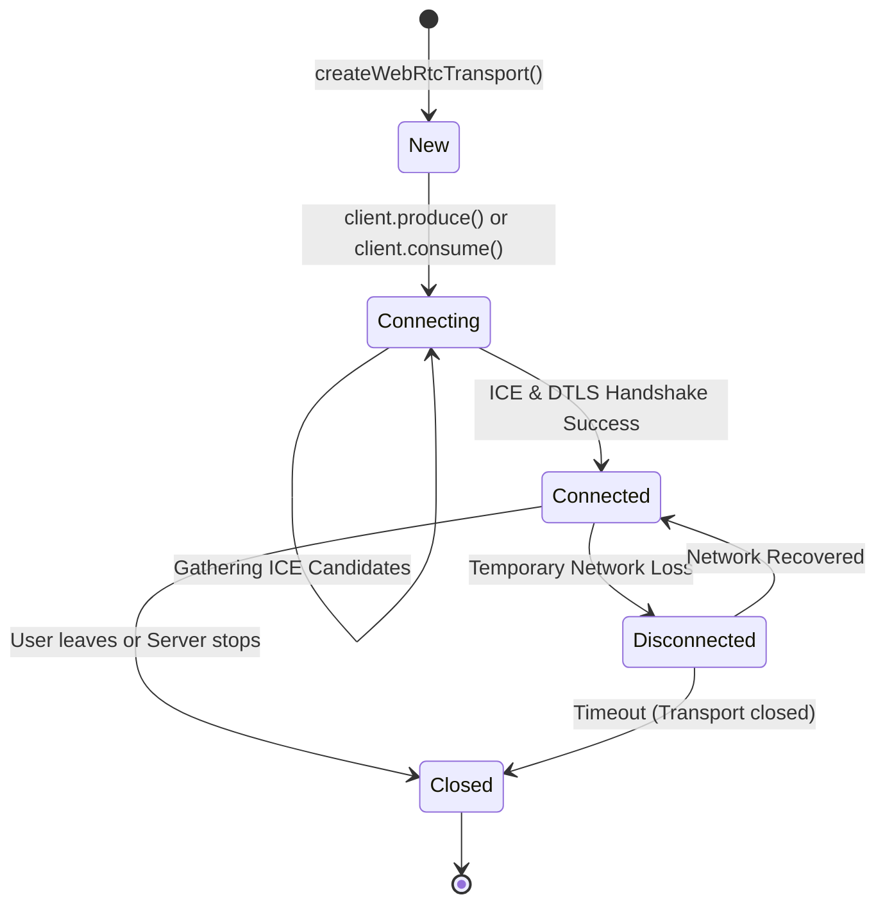
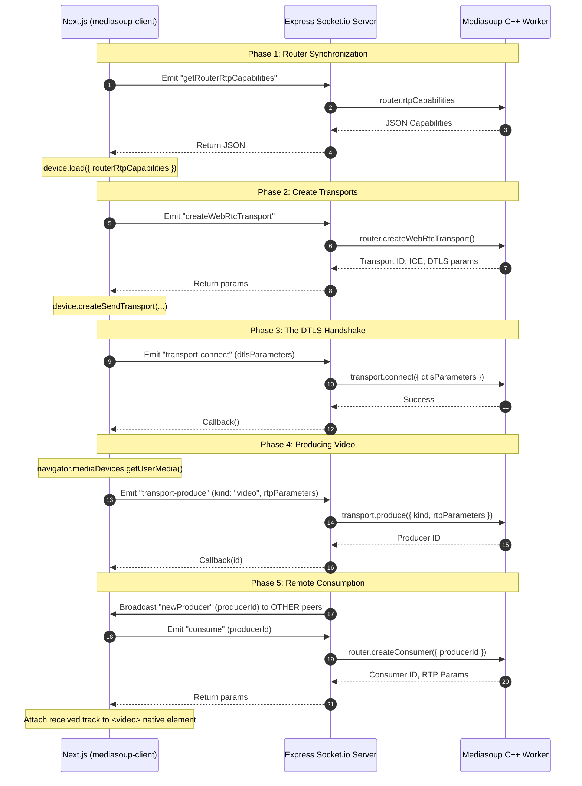

# WebRTC & Mediasoup SFU Implementation Deep Dive

StreamLy utilizes **Mediasoup** to power its massive group video and audio routing. This document provides an exhaustive theoretical explanation, state machine diagrams, and practical signaling sequence workflows for the entire WebRTC layer.

## 🧠 Theoretical Background: Why SFU is Mandatory for Groups

In WebRTC, there are three primary topologies for connecting multiple peers. StreamLy rejects the first two for mathematical scaling reasons.

1.  **Mesh (P2P)**: Every participant connects directly to every other participant. 
    *   *The Fatal Flaw*: Bandwidth scales at $O(N^2)$. In a 10-person group call, your laptop must encode its camera feed 9 separate times and upload it 9 separate times. Your home internet upload speed collapses instantly.
2.  **MCU (Multipoint Control Unit)**: A central server receives all 10 videos, stitches them together into a single "flattened" 1080p composite video frame (like a CCTV grid), and sends one video stream back to everyone.
    *   *The Fatal Flaw*: Extremely high CPU cost on the backend. More importantly, the UI loses all flexibility—the client cannot choose to "Pin" a specific person or hide someone, because the video is a single pre-rendered stream.
3.  **SFU (Selective Forwarding Unit)**: A central server receives *one* upload stream from each participant and selectively forwards it to the others based on their requests.
    *   *The StreamLy Solution*: Bandwidth scales linearly $O(N)$. The client retains full control over independent `MediaStreamTracks`, allowing our powerful Next.js frontend to dynamically render the "Spotlight Pinned View."

---

## 🗺️ State Machine: The WebRTC Connection Lifecycle

Before a user sees video, their connection must pass through several strict states governed by Mediasoup and the ICE (Interactive Connectivity Establishment) protocol.



---

## 📡 The Signaling Workflow: Step-by-Step

WebRTC is fundamentally a peer-to-peer protocol, even when connecting to a server (the SFU acts as the other "peer"). Therefore, the client and server must exchange cryptographic keys (DTLS), capabilities (RTP), and IP pathways (ICE) before sending a single byte of video data.

This is coordinated exclusively over the **Socket.io** connection.



---

## 🖥️ The UI Implementation: Bypassing the Canvas

Historically, complex web applications route remote `MediaStream` objects through hidden HTML5 `<canvas>` elements to apply visual processing or standardized layouts before displaying them. 

**StreamLy explicitly rejects this methodology for production.**

### The Problem with Canvas Loops
Applying a `requestAnimationFrame` loop to draw a video to a canvas requires continuous main-thread execution. When Google Chrome (or Edge) minimizes a tab or puts it in the background to save memory, it aggressively throttles `requestAnimationFrame` to 1 frame per second, or halts it entirely. This causes the user's video feed to freeze completely for everyone else in the call.

### The Direct Binding Architecture
We bind the raw `MediaStream` track directly to the native DOM element.

```tsx
// Inside RemoteVideo.tsx Component
<video 
  autoPlay 
  muted={false} 
  playsInline 
  ref={(el) => { 
    if (el && stream) el.srcObject = stream; 
  }} 
  className="w-full h-full object-cover" 
/>
```

By allowing the browser's lower-level C++ rendering engine to handle the `srcObject`, we achieve:
1.  **Zero background suspension freezing.**
2.  **Sub-millisecond frame rendering latency.**
3.  **Massive reduction in JavaScript heap memory usage.**

This native binding allows our dynamic Tailwind CSS classes (governed by the `pinnedStreamId` state) to scale, animate, and reshape the video elements in the Spotlight Carousel purely through CSS transforms, utilizing GPU hardware acceleration entirely independent of the video decoding thread.
