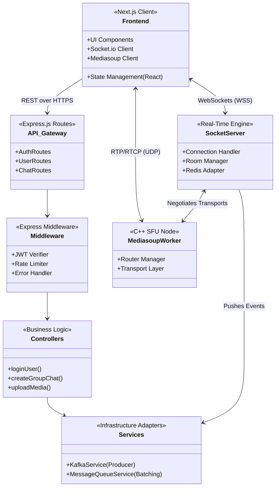
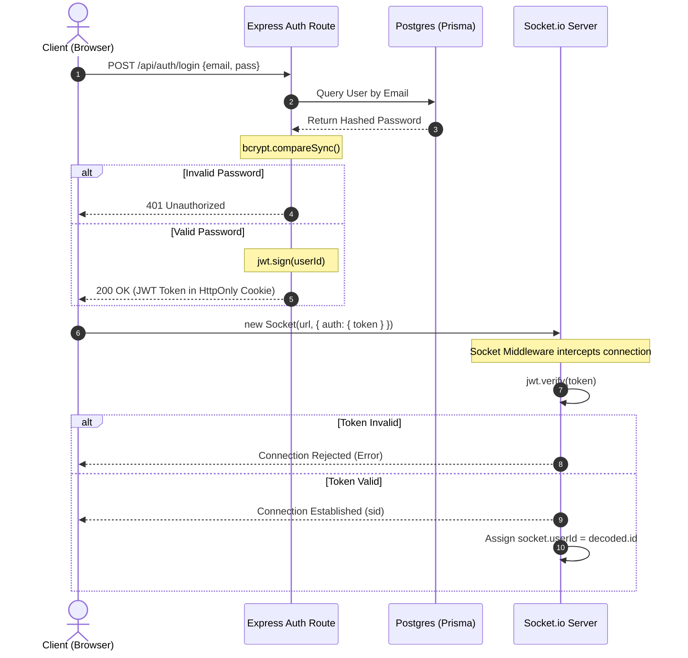

# System Architecture & UML Topologies

StreamLy is engineered as a modern, decoupled monorepo. The primary philosophy behind the architecture is **scalability through event-driven processing**. Real-time applications traditionally suffer from tight coupling between WebSocket events and database operations, leading to critical bottlenecks. StreamLy solves this by employing Redis, Kafka, and a highly modular Express.js backend.

This document serves as an exhaustive theoretical and practical deep-dive into the architectural boundaries and internal workflows of the system.

---

## 🏢 Monorepo Structure & Component UML

The project is strictly divided into two primary execution contexts. To understand the flow of data, we must first map the internal components of the Node.js backend using a standard UML Component Diagram.

### 1. `/frontend` (Next.js 15 & Tailwind CSS)
*   **Presentation Layer**: Responsible purely for rendering the DOM and managing user interactions.
*   **Decoupled State**: Uses modern React hooks to manage `isScreenSharing`, `pinnedStreamId`, and `activeFilter`. 
*   **Transport Clients**: Instantiates `socket.io-client` for persistent JSON signaling and `mediasoup-client` for WebRTC byte-level transport negotiation.

### 2. `/backend` (Node.js & Express)
*   **Unified API Gateway**: Handles standard RESTful requests (Authentication, fetching historical chat logs, updating profile pictures).
*   **Socket.io Server**: The beating heart of the system. It listens for volatile events (`TYPING`, `JOIN_ROOM`, `SEND_MESSAGE`) and orchestrates the response.
*   **Mediasoup Core**: Runs native C++ worker threads parallel to the Node.js event loop to process massive UDP video packet flows without blocking V8.

---

## 🔐 Core Workflow: Authentication Sequence

Before any real-time media or messaging can occur, the system must securely authenticate the user and upgrade their connection.

### Security Implications
*   **Stateless REST**: The Express API remains entirely stateless. Sessions are never stored in memory; everything relies on cryptographically signed JWTs.
*   **Socket Handshake Protection**: The WebSocket connection *will refuse the TCP upgrade* if a valid JWT is not provided in the handshake auth payload. This prevents malicious actors from opening ghost TCP connections to DDoS the server.

---

## 🌐 The Scaling Strategy: Horizontal Distribution

When StreamLy scales beyond 10,000 concurrent connections, a single Node.js instance will hit CPU limits due to V8 garbage collection and Mediasoup worker limits. The architecture is explicitly designed for **Horizontal Scaling**.

1.  **Stateless APIs**: Because JWTs are used, you can place a Load Balancer (e.g., AWS ALB or Nginx) in front of 5 identical Node.js containers. Request 1 might hit Container A, Request 2 might hit Container B. It does not matter.
2.  **Socket.io Sticky Sessions**: The load balancer *must* use sticky sessions (hashing the user's IP) so the WebSocket polling phase successfully completes the protocol upgrade on the same physical container.
3.  **Redis State Bridging**: If User X is on Container A, and User Y is on Container B, and they are in the same Group Chat, they are theoretically isolated. **Redis Pub/Sub** solves this. When User X sends a message, Container A publishes it to Redis. Redis instantly pushes it to Container B, which emits it to User Y. This architecture allows StreamLy to scale to infinite Node.js instances seamlessly.
